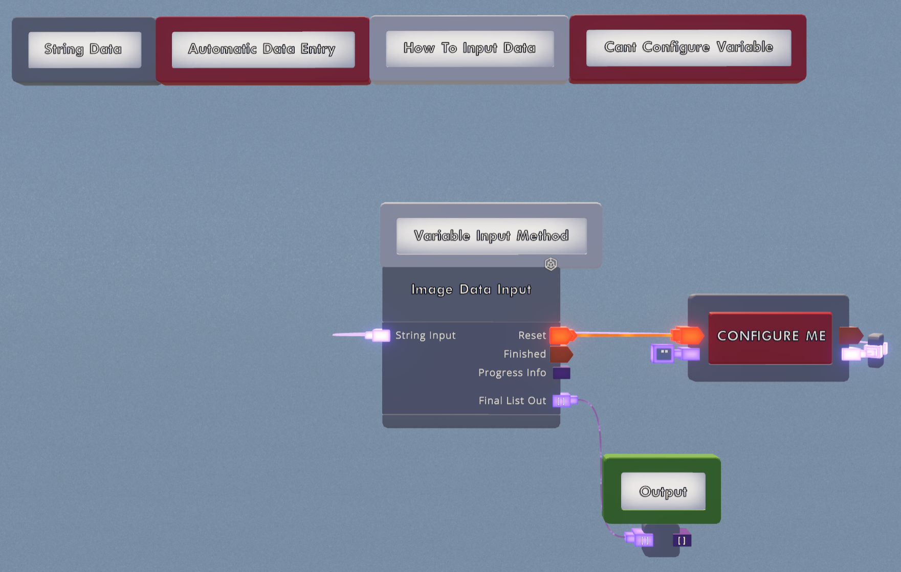
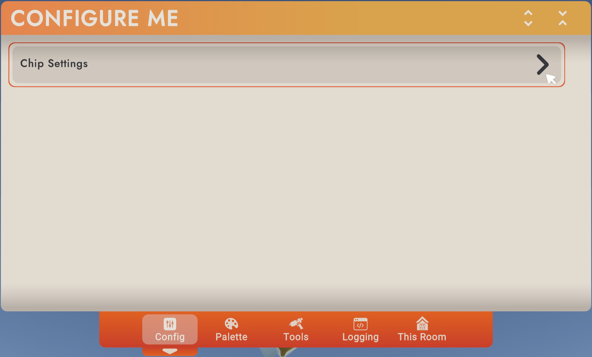
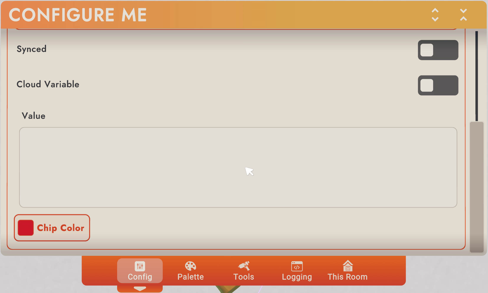
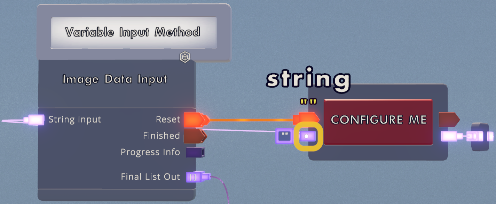

# Draw Bot Encoding

This repository is **only** for converting, encoding and importing a PNG image into a RecRoom invention.

As for the in-game *circuits v2* parsing and printing systems, you will either have to build it yourself 
or buy it from me.\
If you're interested in purchasing the cv2 part of the logic, message me on Discord: `McRen#2940`

## How to use 

Run `CanvasPrinter.py`.

Select a PNG image you want to import into RecRoom.\
I suggest the image is already converted into a RecRoom color palette 
(Photoshop ACO swatch files are included), and scaled to the appropriate size.

If the image is not converted it will automatically get converted, but the image quality might be worse as a result of
no image dithering yet being implemented.

After the data has been encoded, you will be prompted to import all data to RecRoom.\
For this you need the invention called `Variable Data Import`.

Spawn the invention (it should look like the image below).

Configure the **red** string variable named `CONFIGURE ME`,\
expand the `Chip Settings`\

Scroll down until you see the `Value` input field, as shown in the image below (the `Value` field may be colored green). 

Now you can run the script and sit back until the importing is done.

If you're unable to configure the variable or if the menu is not appearing, spawn your own `String Variable`, 
and wire it to the same inputs and outputs as the existing one. The name of the Variable does not matter.\
The String input of the Variable **should be empty** (as shown in the image below)

When done importing the output of the chip will be a `List[List[string]]`.\
See `Encoding.py` for encoding template.

Currently, only **2560x1440** and **1920x1080** resolutions supported.
