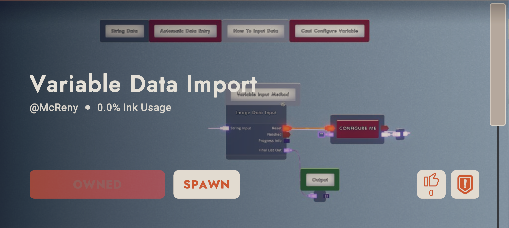

# Draw Bot Encoding

Run `CanvasPrinter.py`.

Select an image you want to import into RecRoom. I suggest the image is already converted into a RecRoom color palette 
(Photoshop ACO swatch files are included), and scaled to the appropriate size.

If the image is not converted it will automatically get converted, but the image quality might be worse as a result of
no image dithering yet being implemented.

After the data has been encoded, you will be prompted to import all data to RecRoom. For this you need the invention
called `Variable Data Import`;

Spawn the invention (it should look like the image below),

Configure the **red** `CONFIGURE ME` variable, expand the `Chip Settings` and scroll down. You should see the same thing 
as the image below. 

If you're unable to configure the variable or if the menu is not appearing, spawn your own variable, and wire it to the 
same input as the existing one.

**Don't forget to rename the newly spawned variable to the same name as the one before `CONFIGURE ME`** 
*all capitals*

When done importing the output of the chip will be a List[List[string]].

Currently, only **2560x1440** and **1920x1080** resolutions supported.
